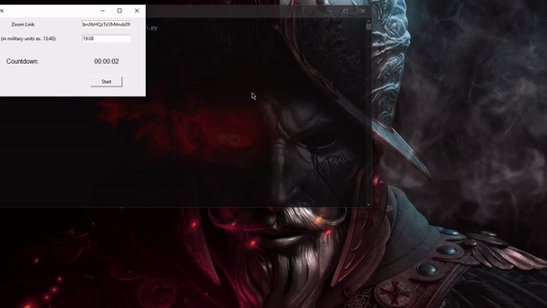

### A gui python 🐍 script to automatically join you in a Zoom class/meeting 🧲

### ⬇️How to download⬇️:
<ul>
    <li>Open this link: https://drive.google.com/drive/folders/1C5fEu82Do1Vxe4Tp3qggMUq1Btr9iBiv?usp=sharing.</li>
    <li>Open the AZJ folder.</li>
    <li>look for the 'AZJ.exe'. Windows might flag it as a trojan, it's false positive.</li>
    <li>Open it. It's just that easy!!!</li>
</ul>

### ⬇️How to download for pro programmers⬇️:
<ul>
    <li>Make sure you have python3</li>
    <li>Clone the repository</li>
    <li>You can run this on your CMD: 'zoom-env\Scripts\activate.bat'</li>
    <li>Then run in the CMD: 'python3 main.py'</li>
</ul>

### 👓How to use👓:
<ul>
    <li>Place the link in the entry box.</li>
    <li>Set a time. Make sure it's in the military format e.g. 16:20, 04:42</li>
    <li>Press start.</li>
    <li>Let the magic happen! Once the timer hits 0, it will join you into the Zoom meeting.</li>
</ul>

### 📼Working Example📼:

Suggestions are open! It's just a short shitty python script, so it's not perfect yet. But it works good.
Bug: When no zoom app is found, program crashes.

<!--
    ReadMe.md s
-->